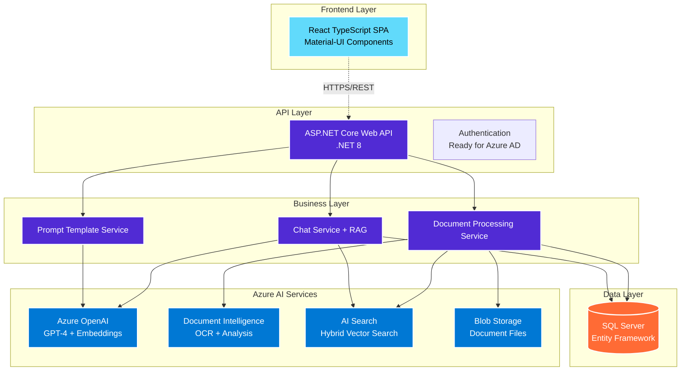
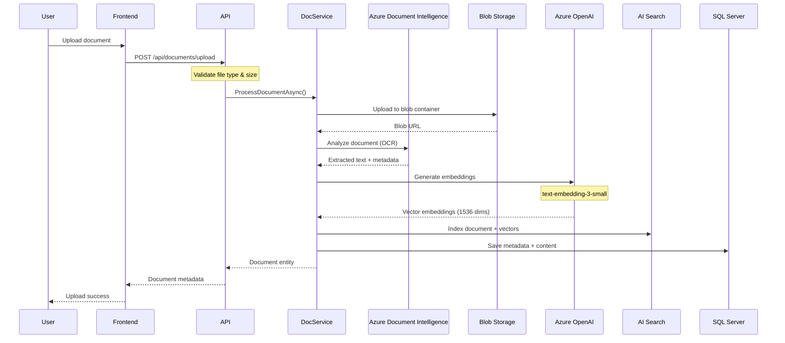
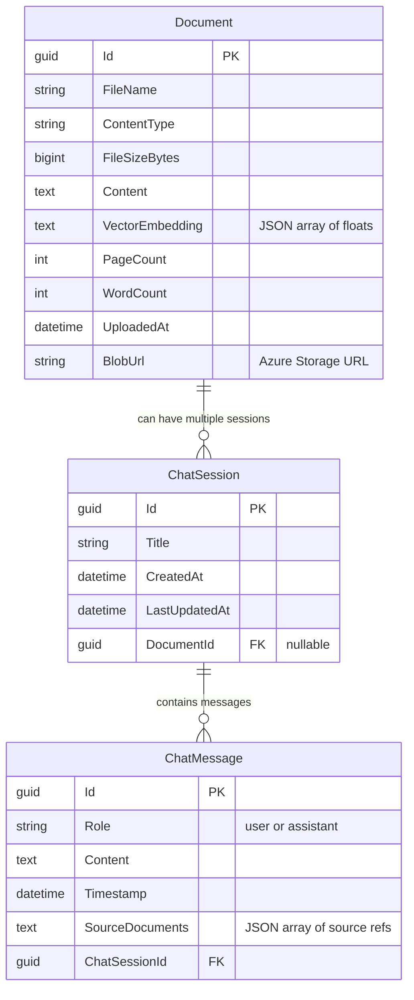
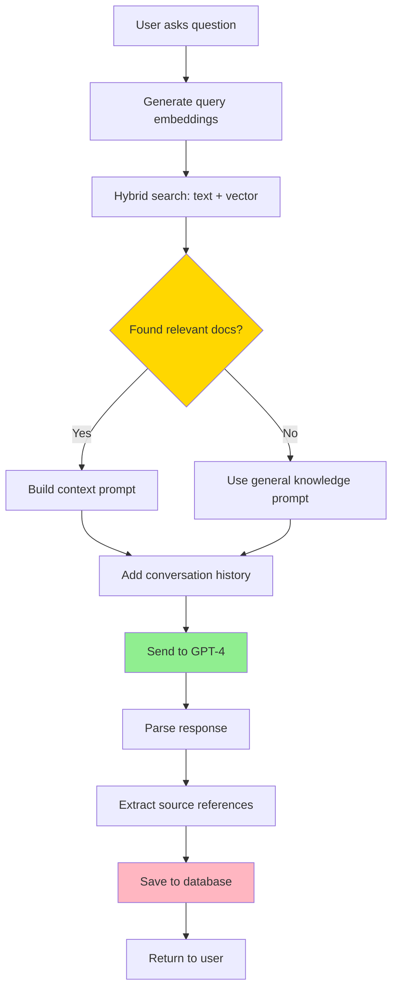

# Azure AI Document Chat Platform - Technical Architecture

## System Overview

This is the main architecture doc for our Azure AI chat platform. Been working on this for a while - it's gotten pretty complex but the RAG implementation is solid now. The whole thing basically takes documents, processes them with Azure's AI stuff, and lets users chat with the content.

<!-- TODO: Add performance metrics section when we get some real usage data -->
<!-- FIXME: The token counting is still rough - need to implement proper tiktoken -->

## High-Level Architecture



## Document Processing Flow

This is probably the most complex part - took forever to get the embedding pipeline right.



## Technology Stack

### Frontend Layer
- **Framework**: React 18 with TypeScript
- **UI Components**: Material-UI (MUI) v5
- **State Management**: React Hooks (useState, useEffect)
- **HTTP Client**: Axios with TypeScript interfaces
- **Build Tool**: Create React App with TypeScript template

### Backend Layer
- **Framework**: ASP.NET Core 8 Web API
- **Language**: C# 12
- **Architecture Pattern**: Clean Architecture with Service Layer
- **Dependency Injection**: Built-in ASP.NET Core DI Container
- **API Documentation**: Swagger/OpenAPI 3.0

### Data Layer
- **Primary Database**: Microsoft SQL Server
- **ORM**: Entity Framework Core 9
- **Migration Strategy**: Code-First with automatic migrations
- **Connection Management**: Connection pooling with retry policies

### Azure AI Services Integration
- **Document Intelligence**: Text extraction and document analysis
- **OpenAI Service**: GPT-4 for chat, text-embedding-3-small for vectors
- **AI Search**: Hybrid search (text + semantic vector search)
- **Blob Storage**: Scalable document storage with hierarchical organization

## Core Service Architecture

### Service Layer Design

```csharp
// Primary Services
├── DocumentProcessingService    // Document upload, OCR, indexing
├── ChatService                  // Conversation management, RAG implementation
├── PromptTemplateService       // Centralized prompt management
└── AdvancedChatService         // Extended AI capabilities (optional)

// Cross-Cutting Concerns
├── Configuration Management    // Azure service configuration
├── Error Handling             // Centralized exception management
├── Logging                    // Structured logging with correlation IDs
└── CORS Policy               // Cross-origin resource sharing
```

### Data Models and Relationships

The DB schema is pretty straightforward - just documents, chat sessions, and messages. Had to make some decisions about storing embeddings (went with JSON for now, might move to proper vector DB later).



<!-- NOTE: Considered using Azure SQL's native vector support but it's still preview -->
<!-- The JSON approach works fine for now, easy to query and update -->

## Processing Workflows

### Document Upload and Processing Pipeline

1. **File Reception**: Multipart form upload via REST API
2. **Storage**: Upload to Azure Blob Storage with unique naming
3. **Analysis**: Azure AI Document Intelligence extracts text and metadata
4. **Vectorization**: Generate embeddings using Azure OpenAI text-embedding-3-small
5. **Indexing**: Store in Azure AI Search with hybrid search configuration
6. **Persistence**: Save metadata and content to SQL Server database

### RAG (Retrieval-Augmented Generation) Workflow

The RAG flow is where the magic happens. Spent a lot of time tuning the retrieval part - the hybrid search really makes a difference vs just vector similarity.



Key optimizations we've done:
- Chunk documents smartly (overlap + semantic boundaries)
- Use reranking after initial retrieval  
- Track which chunks actually influenced the response
- Fallback to broader search if no good matches

### Unified Prompt Management System

```csharp
// Centralized prompt templates with parameter substitution
Templates:
├── document_chat_system      // Primary RAG system prompt
├── document_summary          // Document summarization
├── document_comparison       // Multi-document analysis
├── search_enhancement        // Query optimization
├── context_validation        // Relevance assessment
└── key_phrase_extraction     // Term extraction

Features:
├── Runtime template updates
├── Parameter interpolation
├── Token estimation
├── A/B testing support
└── Configuration overrides
```

## API Architecture

### RESTful Endpoint Design

```
Documents API:
POST   /api/documents/upload        // File upload and processing
GET    /api/documents               // List all documents
GET    /api/documents/{id}          // Retrieve specific document
GET    /api/documents/search        // Semantic document search
DELETE /api/documents/{id}          // Remove document

Chat API:
POST   /api/chat/sessions           // Create new chat session
GET    /api/chat/sessions           // List user's chat sessions
GET    /api/chat/sessions/{id}      // Get session with message history
POST   /api/chat/sessions/{id}/messages  // Send message to session

Prompts API:
GET    /api/prompts/templates       // List available prompt templates
POST   /api/prompts/templates/{name}/render  // Render template with params
PUT    /api/prompts/templates/{name}         // Update template at runtime
POST   /api/prompts/test            // Test prompt configuration
```

### Error Handling and Validation

- **Global Exception Middleware**: Centralized error processing with correlation IDs
- **Model Validation**: Data annotation validation with custom error responses
- **Azure Service Failures**: Retry policies with exponential backoff
- **Rate Limiting**: Implementation considerations for Azure service quotas

## Security Architecture

### Authentication and Authorization
- **Ready for Integration**: RBAC placeholder for Azure AD B2C
- **API Keys**: Secure storage of Azure service credentials
- **CORS Configuration**: Restricted origins for production deployment

### Data Security
- **Encryption at Rest**: Azure Storage and SQL Server encryption
- **Encryption in Transit**: HTTPS/TLS 1.3 for all communications
- **Secret Management**: Azure Key Vault integration (configuration ready)
- **Data Isolation**: Tenant-aware data access patterns (prepared)

## Performance and Scalability

### Optimization Strategies
- **Connection Pooling**: Entity Framework connection management
- **Async Operations**: Comprehensive async/await implementation
- **Token Management**: Intelligent context truncation for LLM limits
- **Caching Strategy**: Ready for Redis integration for prompt caching

### Monitoring and Observability
- **Structured Logging**: Comprehensive logging with correlation tracking
- **Health Checks**: Database and Azure service availability monitoring
- **Performance Counters**: Response time and throughput tracking
- **Error Tracking**: Detailed exception logging and alerting

## Deployment Architecture

### Environment Configuration
- **Development**: LocalDB with Azure service integration
- **Staging**: Azure SQL Database with resource group isolation
- **Production**: Scaled Azure resources with high availability

### Infrastructure as Code
```yaml
Azure Resources Required:
├── Resource Group
├── Azure OpenAI Service (GPT-4 + text-embedding-3-small)
├── Azure AI Document Intelligence
├── Azure AI Search (with semantic search enabled)
├── Azure Storage Account (with blob containers)
├── Azure SQL Database
└── Azure App Service (for API hosting)
```

## Development and Maintenance

### Code Quality Standards
- **Clean Architecture**: Clear separation of concerns
- **SOLID Principles**: Dependency injection and interface abstraction
- **Error Handling**: Comprehensive exception management
- **Documentation**: Inline documentation and API specifications

### Testing Strategy
- **Unit Tests**: Service layer and business logic validation
- **Integration Tests**: Azure service interaction verification
- **API Tests**: Endpoint functionality and error handling
- **E2E Tests**: Complete workflow validation

This architecture provides a robust foundation for enterprise document processing and conversational AI applications, with clear scalability paths and maintainable code organization.