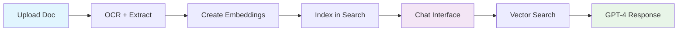
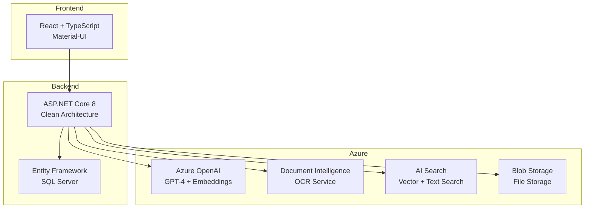

# Azure AI Document Chat Platform

So this started as a quick demo of Azure AI services but ended up being a pretty full-featured document chat system. The RAG implementation is solid now and handles decent-sized document collections. Built it to show off what you can do with the new Azure AI Foundry stuff.

## What it does

Basically you upload PDFs, Word docs, whatever - it OCRs them, creates vector embeddings, then you can chat with the content. Uses GPT-4 for the chat and does semantic search to find relevant chunks. Works pretty well, the hybrid search approach (text + vector) gives much better results than just cosine similarity.



## Core Features

### Document Processing
- Handles PDFs, Word docs, images, plain text 
- Azure Document Intelligence for OCR (works really well on scanned docs)
- Automatic chunking with overlap for better retrieval
- Vector embeddings via text-embedding-3-small (1536 dimensions)

### Chat & RAG
- GPT-4 powered conversations with your documents
- Hybrid search: combines text matching + semantic similarity  
- Source attribution - shows which docs/sections were used
- Conversation history per session
- Configurable prompts (no more hardcoded system messages!)

### Technical Stack


<!-- TODO: Add auth integration (probably Azure AD B2C) -->
<!-- FIXME: Token counting is approximate, should use tiktoken for accuracy -->

## Technical Stack

**Frontend**: React 18, TypeScript, Material-UI, Axios
**Backend**: ASP.NET Core 8, C# 12, Entity Framework Core
**Database**: Microsoft SQL Server with Code-First migrations
**Azure Services**: OpenAI, Document Intelligence, AI Search, Blob Storage
**Architecture**: Clean Architecture, Dependency Injection, RESTful APIs

## Solution Architecture

```
├── AzureAiDocumentChat.Api/       # ASP.NET Core Web API
│   ├── Controllers/               # REST API endpoints
│   ├── Services/                  # Business logic and Azure integrations
│   ├── Models/                    # Entity models and DTOs
│   ├── Data/                      # Entity Framework DbContext
│   └── Configuration/             # Service configuration and DI setup
├── azure-ai-chat-frontend/        # React TypeScript SPA
│   ├── src/components/            # Reusable UI components
│   ├── src/api/                   # HTTP client and service interfaces
│   └── src/types/                 # TypeScript type definitions
├── ARCHITECTURE.md                # Detailed technical architecture
└── Documentation/                 # Additional technical documentation
```

## Getting it Running

### What you need

- .NET 8 SDK (latest)
- Node.js 18+ (for the React frontend)  
- SQL Server (LocalDB is fine for dev)
- Azure subscription with these services:
  - Azure OpenAI Service (need GPT-4 and text-embedding-3-small models)
  - Azure AI Document Intelligence 
  - Azure AI Search service (with semantic search enabled)
  - Azure Storage Account (for document files)

### Azure Setup Notes

The Azure AI Search index needs specific schema - check the ARCHITECTURE.md for details. The vector field needs to be 1536 dimensions to match the embedding model.

Also make sure you have quota for the OpenAI models - GPT-4 can be limited depending on your subscription tier.

### 1. Configure Azure Services

Update `AzureAiDocumentChat.Api/appsettings.json` with your Azure service endpoints and keys:

```json
{
  \"AzureAI\": {
    \"OpenAI\": {
      \"Endpoint\": \"https://YOUR_OPENAI_RESOURCE.openai.azure.com/\",
      \"ApiKey\": \"YOUR_OPENAI_API_KEY\",
      \"DeploymentName\": \"gpt-4\"
    },
    \"DocumentIntelligence\": {
      \"Endpoint\": \"https://YOUR_DOCUMENT_INTELLIGENCE_RESOURCE.cognitiveservices.azure.com/\",
      \"ApiKey\": \"YOUR_DOCUMENT_INTELLIGENCE_API_KEY\"
    },
    \"Search\": {
      \"Endpoint\": \"https://YOUR_SEARCH_SERVICE.search.windows.net\",
      \"ApiKey\": \"YOUR_SEARCH_API_KEY\",
      \"IndexName\": \"documents-index\"
    },
    \"Storage\": {
      \"ConnectionString\": \"DefaultEndpointsProtocol=https;AccountName=YOUR_STORAGE_ACCOUNT;AccountKey=YOUR_STORAGE_KEY;EndpointSuffix=core.windows.net\",
      \"ContainerName\": \"documents\"
    }
  }
}
```

### 2. Setup Azure AI Search Index

Create an index in Azure AI Search with the following schema:

```json
{
  \"name\": \"documents-index\",
  \"fields\": [
    {\"name\": \"id\", \"type\": \"Edm.String\", \"key\": true, \"searchable\": false},
    {\"name\": \"fileName\", \"type\": \"Edm.String\", \"searchable\": true, \"filterable\": true},
    {\"name\": \"content\", \"type\": \"Edm.String\", \"searchable\": true},
    {\"name\": \"uploadedAt\", \"type\": \"Edm.DateTimeOffset\", \"filterable\": true, \"sortable\": true},
    {\"name\": \"wordCount\", \"type\": \"Edm.Int32\", \"filterable\": true},
    {\"name\": \"pageCount\", \"type\": \"Edm.Int32\", \"filterable\": true},
    {\"name\": \"contentVector\", \"type\": \"Collection(Edm.Single)\", \"searchable\": true, \"dimensions\": 1536, \"vectorSearchProfile\": \"default\"}
  ]
}
```

### 3. Run the Backend

```bash
cd AzureAiDocumentChat.Api
dotnet restore
dotnet run
```

Should start up on `https://localhost:7067` - check the Swagger UI to make sure the endpoints are working.

### 4. Run the Frontend

```bash
cd azure-ai-chat-frontend
npm install
npm start
```

React dev server starts on `http://localhost:3000`. CORS is already configured for this port.

### Troubleshooting

**Common issues:**
- If embeddings fail, check your Azure OpenAI model deployment names
- Document upload errors usually mean blob storage config is wrong  
- Search not working = check the AI Search index schema
- Database errors = make sure connection string is right for your SQL setup

The logs are pretty verbose so check the console output when things break.

## Key Features Demonstrated

### 1. Document Processing Pipeline
- Upload documents via drag-and-drop or file picker
- Azure AI Document Intelligence extracts text and metadata
- Vector embeddings generated using Azure OpenAI
- Documents indexed in Azure AI Search for hybrid search

### 2. RAG (Retrieval-Augmented Generation)
- Semantic search finds relevant document sections
- GPT-4 answers questions using retrieved context
- Source attribution shows which documents informed the response
- Conversation history maintained per chat session

### 3. Unified Prompt Management System
- **Centralized Prompts**: All AI prompts managed in `PromptTemplateService`
- **Template System**: Parameterized prompts with variable substitution
- **Runtime Updates**: Modify prompts without redeployment
- **Prompt Testing**: API endpoints for testing and validating prompts
- **Token Estimation**: Built-in token counting for cost management
- **Multiple Strategies**: Different prompts for different query types

### 4. Modern Architecture Patterns
- Clean separation of concerns with services layer
- Entity Framework Code First with proper relationships
- React hooks with TypeScript for type safety
- Material-UI for professional UI components

## Technical Notes

- **Vector Search**: Uses text-embedding-3-small (1536 dimensions) for semantic similarity
- **Hybrid Search**: Combines traditional text search with vector similarity
- **Context Management**: Truncates long documents to stay within token limits
- **Error Handling**: Comprehensive error handling with user-friendly messages
- **CORS**: Configured for local development

## Prompt Management System

One thing I'm pretty happy with is the unified prompt system. Got tired of having prompts scattered all over the codebase, so I built a centralized service for managing them.

### Available Templates
- `document_chat_system` - Main RAG system prompt  
- `document_summary` - Summarization prompts
- `document_comparison` - Multi-doc analysis 
- `search_enhancement` - Query optimization
- `context_validation` - Relevance scoring

The cool thing is you can update prompts at runtime via the API, which is great for A/B testing different prompt strategies.

### Usage Examples

```csharp
// Basic prompt with parameters
var prompt = _promptService.GetPrompt("document_summary", new Dictionary<string, string>
{
    {"DOCUMENT_NAME", "Research Paper.pdf"},
    {"DOCUMENT_CONTENT", documentText}
});

// Build context-aware chat prompt
var chatPrompt = _promptService.BuildDocumentChatPrompt(relevantDocuments);

// Get prompt with token estimation
var (prompt, tokens) = _promptService.GetPromptWithTokenEstimate("document_chat_system", parameters);
```

### API Endpoints for Prompt Management

- `GET /api/prompts/templates` - List all available templates
- `POST /api/prompts/templates/{name}/render` - Render a template with parameters
- `PUT /api/prompts/templates/{name}` - Update a template at runtime
- `POST /api/prompts/test` - Test prompts with sample data

### Configuration

Add prompt settings to `appsettings.json`:

```json
{
  "PromptSettings": {
    "MaxContextLength": 3000,
    "EnablePromptCaching": true,
    "DefaultTokenLimit": 4000,
    "PromptTemplateOverrides": {
      "document_chat_system": "Your custom prompt here..."
    }
  }
}
```

## Potential Enhancements

- Add user authentication/authorization
- Implement document preview functionality
- Add support for more file types
- Batch document processing
- Real-time chat updates with SignalR
- Document versioning and change tracking
- Advanced search filters and faceting
- **Prompt A/B testing framework**
- **Prompt performance analytics**
- **Multi-language prompt templates**

## Production Deployment

Haven't deployed this to prod yet but here's what you'd need:

### Azure Resources
- Resource Group (obviously)
- App Service for the API (probably Standard tier minimum)
- Azure SQL Database (Basic tier might work for small loads)
- All the AI services mentioned above
- Application Insights for monitoring
- Key Vault for storing secrets properly

### Performance Notes
The main bottleneck is going to be the OpenAI API calls. The embedding generation can be slow for large documents. Consider:
- Async processing for document uploads
- Caching embeddings if you reprocess the same content
- Rate limiting to stay within Azure quotas

### Security TODO
- Move all the API keys to Key Vault 
- Set up managed identity for service auth
- Add proper authentication (Azure AD B2C probably)
- Network security groups for the Azure resources

The current setup is fine for demo/dev but you'd want to lock it down for production.

## Documentation

For detailed technical architecture, service integrations, and deployment specifications, see [ARCHITECTURE.md](./ARCHITECTURE.md).

## License

This project demonstrates Azure AI service integration patterns and is intended for educational and proof-of-concept purposes.